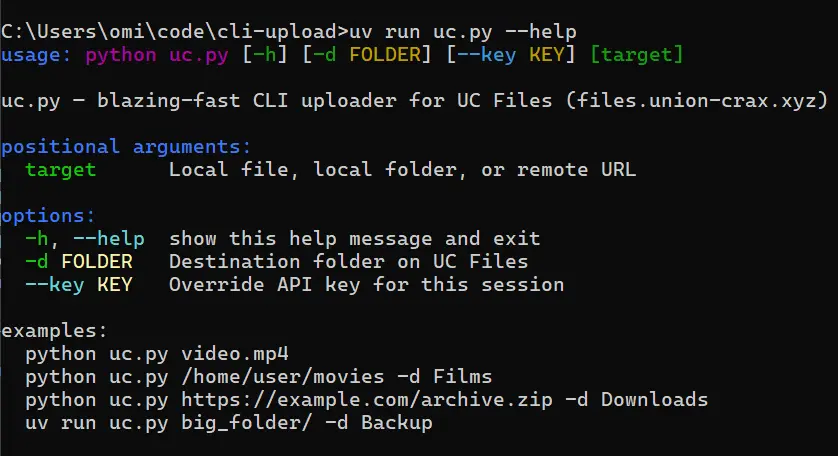

# CLI File Uploaders (ucf v0.0.1)

- [Union Crax (UCF)](#uc)
- [Viking / Gofile](#viking--gofile)
- [Pre-commit & Setup](#pre-commit-git-hook--dev-setup)

---

## UC
Now available as the `ucf` package. The fastest CLI for [union-crax.xyz](https://files.union-crax.xyz).

### Quick Start
Run instantly without installation using `uvx`:
```bash
# Upload a file
uvx ucf file.zip --key "YOUR_KEY"

# Upload to a specific folder
uvx ucf movie.mp4 -d "Movies"
```



### Features & Flags
- **Target Mode**: Supports files, folders, and remote URLs.
- **Auto-Config**: Saves your key to `~/.uc_key` on first run.
- **One-Liner**: `uvx ucf https://link.com/file.zip -d Downloads`

<br clear="right"/>

---

## Viking / Gofile
CLI tools for [VikingFile](https://vikingfile.com) and [Gofile](https://gofile.io).

### Usage Example
```bash
# Gofile
uv run https://github.com/NormTurtle/cli-upload/raw/refs/heads/main/gofile.py target_path

# Viking
uv run https://github.com/NormTurtle/cli-upload/raw/refs/heads/main/viking.py target_path -v
```

---


<details>
<summary><b>Pre-commit & Setup</b></summary>

### Key Protection & Hook Setup
Prevent accidental leaks by installing the local git hooks:

> **IMPORTANT:** After cloning this repo, you must run `python pre_commit.py` once to set up these protections!


- **Set and Forget**: Run `python pre_commit.py` once.
- **Key Masking**: Any time you commit code, the hook automatically swaps your real key with `PASTE_API_KEY_HERE` so you never leak secrets to GitHub.
- **No Extra Work**: Your real keys stay on your computer, so you can keep using the scripts without re-pasting them every time.

#### What happens during a commit:
- **Clean for GitHub**: `API_KEY = "PASTE_API_KEY_HERE"`
- **Live on your PC**: `API_KEY = "Your-Secret-123"`


#### Verification
To confirm your last commit is clean without checking your local file:
```bash
git show HEAD:uc.py
```


</details>


