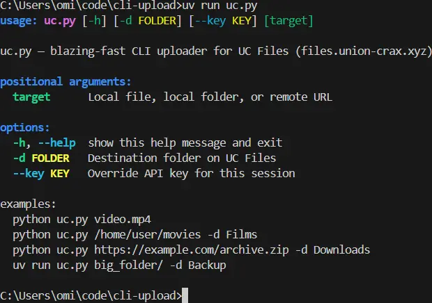

# CLI File Uploaders

- [Union Crax (UC)](#uc)
- [Viking / Gofile](#viking--gofile)
- [Git Hook / Dev Setup](#git-hook--dev-setup)

---

## UC
High-speed CLI for [union-crax.xyz](https://files.union-crax.xyz).

### Installation & Usage
```bash
pip install uv
# Run directly from GitHub
uv run https://github.com/NormTurtle/cli-upload/raw/refs/heads/main/uc.py file.zip --key "YOUR_KEY"
```



### Features & Flags
- **Upload File**: `python uc.py video.mp4`
- **Upload Folder**: `uv run uc.py ./movies -d Films`
- **Remote URL**: `uv run uc.py "https://link.com/file.zip" -d Downloads`
- **API Key**: Pass via `--key KEY` or let it prompt and save to `~/.uc_key`.

<br clear="right"/>

---

## Viking / Gofile
CLI tools for [VikingFile](https://vikingfile.com) and [Gofile](https://gofile.io). Both scripts support recursive folder uploads and real-time progress bars.

### Gofile Usage
Upload files or entire folders to the fastest available regional server:
```bash
uv run https://github.com/NormTurtle/cli-upload/raw/refs/heads/main/gofile.py target_path
```

### Viking Usage
High-speed chunked uploader for VikingFile.
```bash
uv run https://github.com/NormTurtle/cli-upload/raw/refs/heads/main/viking.py target_path [--verbose]
```

---


<details>
<summary><b>Pre commit git-hook / Setup</b></summary>

### Key Protection & Hook Setup
Prevent accidental leaks by installing the local git hooks:

> **IMPORTANT:** After cloning this repo, you must run `python pre_commit.py` once to set up these protections!


- **Set and Forget**: Run `python pre_commit.py` once.
- **Key Masking**: Any time you commit code, the hook automatically swaps your real key with `PASTE_API_KEY_HERE` so you never leak secrets to GitHub.
- **No Extra Work**: Your real keys stay on your computer, so you can keep using the scripts without re-pasting them every time.

#### What happens during a commit:
- **Clean for GitHub**: `API_KEY = "PASTE_API_KEY_HERE"`
- **Live on your PC**: `API_KEY = "Your-Secret-123"`


#### Verification
To confirm your last commit is clean without checking your local file:
```bash
git show HEAD:uc.py
```


</details>


